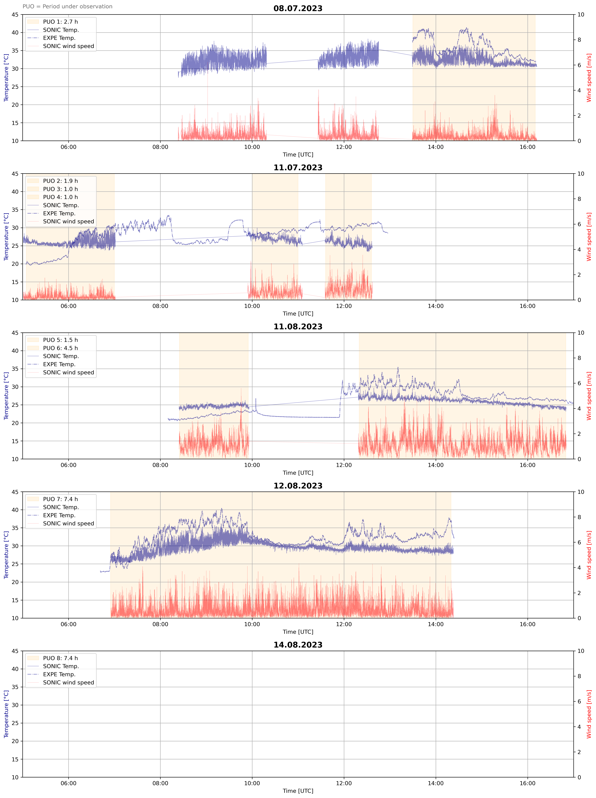

## structure
- `data/` contains the raw data
- `results/` contains the results of the analysis
- `src/` contains the source code

## measuring devices
1. Sonic Anemometer (time measured in UTC+1, without daylight saving time): 3D wind speed and temperature
2. Expe module (time measured in UTC): temperature, rel. humidity and pressure

## temporal_coverage.png

## processing steps
1. parse expe and sonic data
2. detrend time series data
3. calculate FFT
4. calculate averaging errors (for window sizes of 1, 2, 3, 5, 10, 15, 30 minutes)
