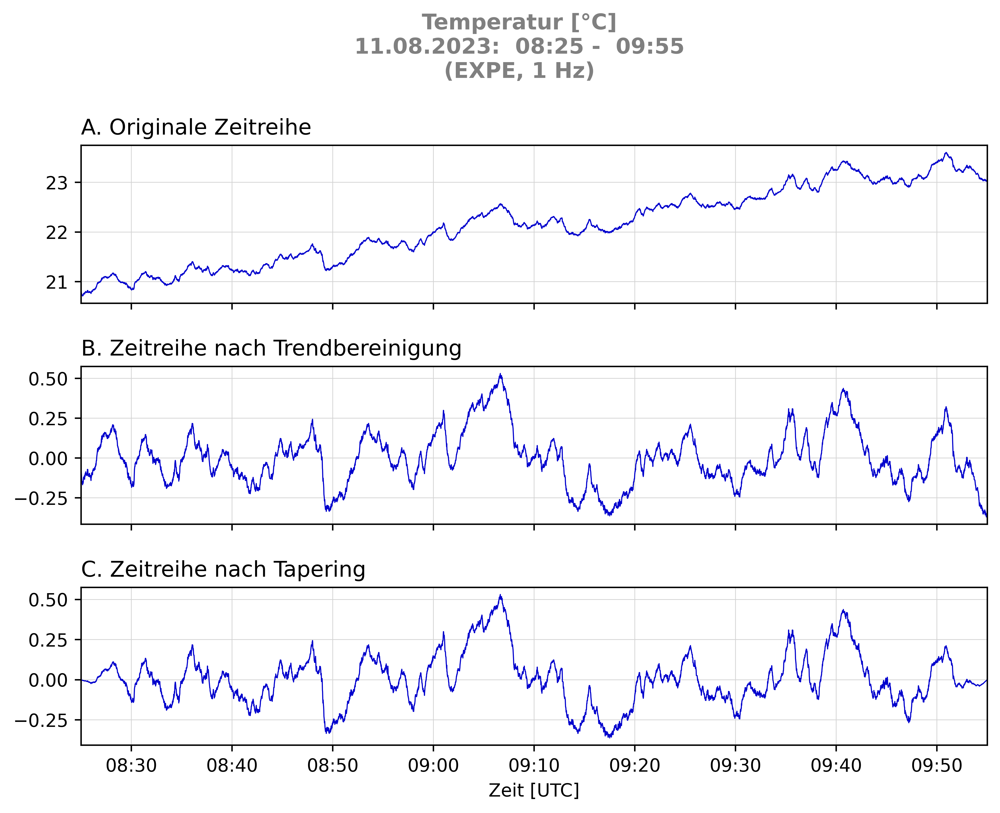
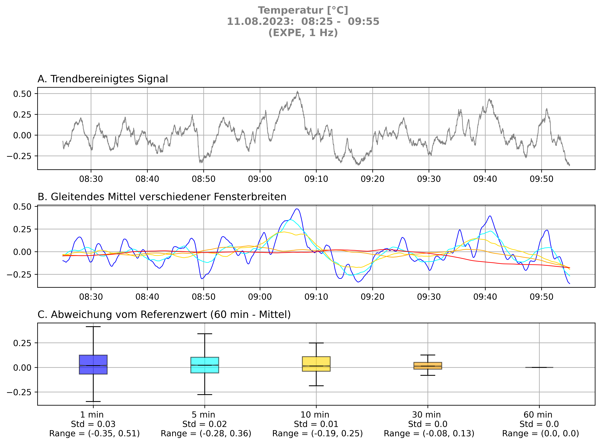
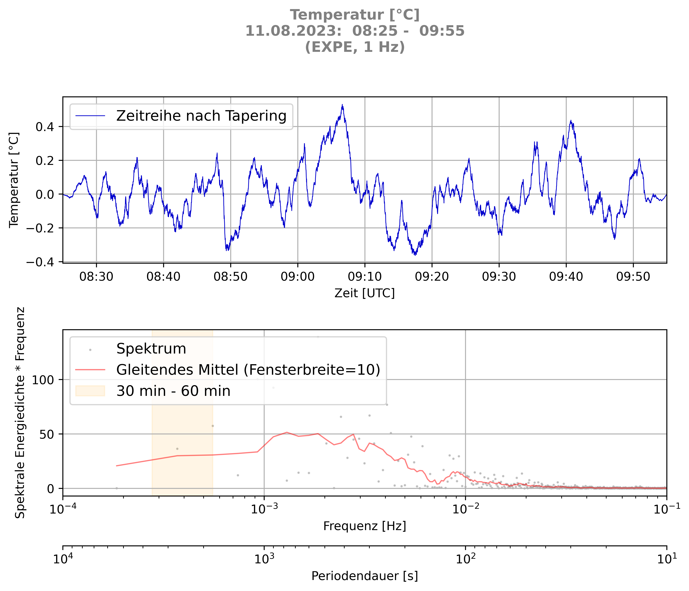
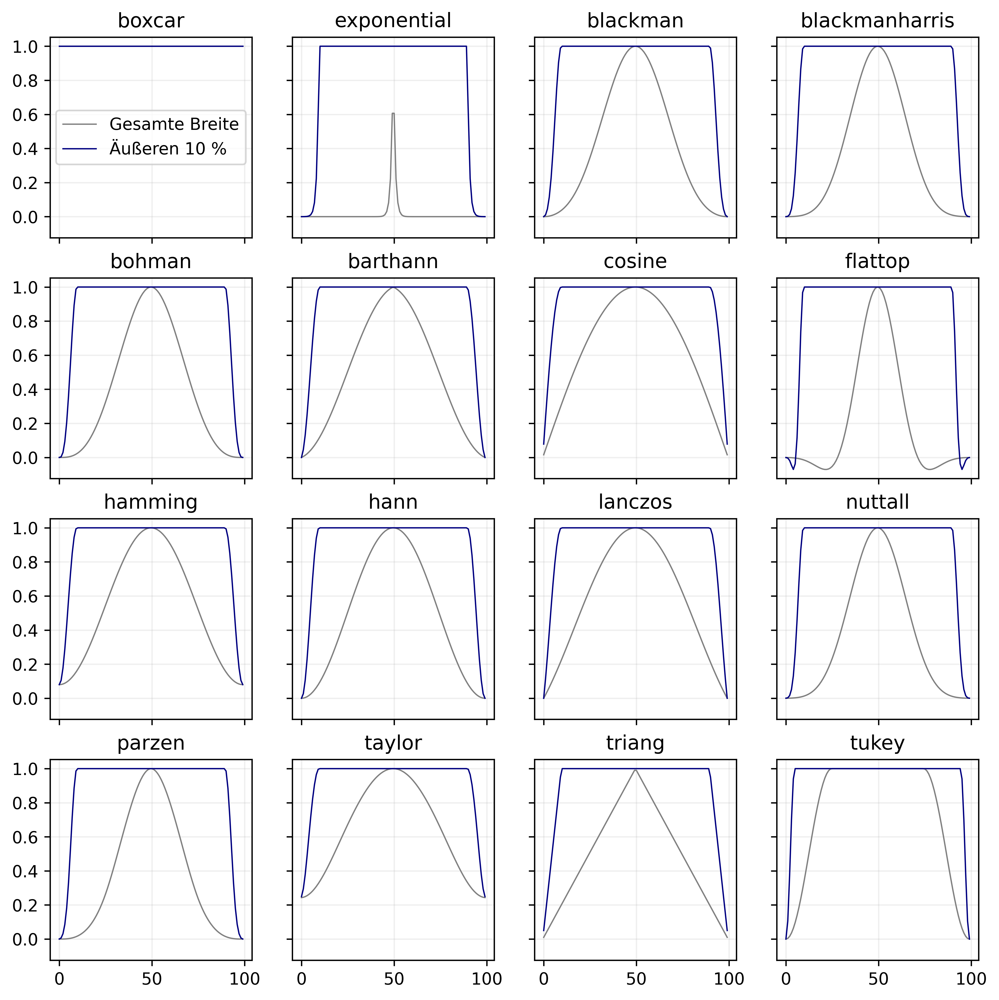
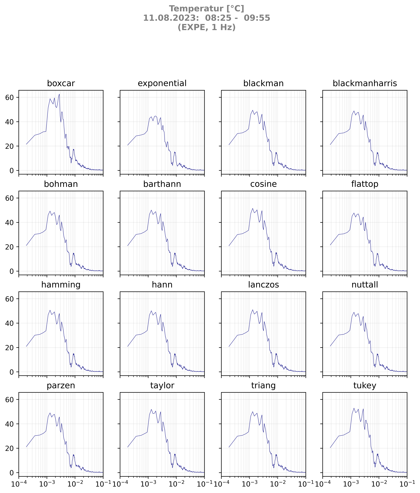
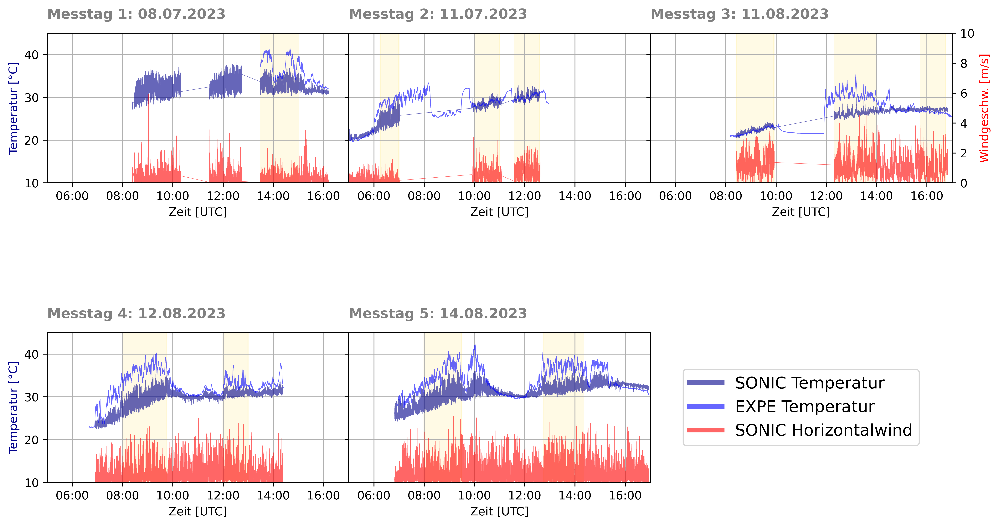

Made as part of the course "MHYD11 Vertiefungspraxis Meteorologie" at TU Dresden.

# Measuring devices
1. Sonic Anemometer:
    - time: UTC+1, without daylight saving time
    - variables: 3D wind speed, temperature
    - filename format: `TOA5_*.Raw_YYYY_MM_DD_*.dat`
2. Expe module:
    - time: UTC
    - variables: temperature, relative humidity, pressure
    - filename format: `YYYYMMDD-HHMM-Log.txt`


## Usage
1. Clone the repository
```bash
git clone git@github.com:lenamueller/turbulenzspektren.git
```
2. Install the required python packages
```bash
pip install -r requirements.txt
```
3. Run the analysis script
```bash
python src/Python_3_11_3/main.py
```

# Content
## `data/`
`raw_data/YYYY_MM_DD/` contains the raw data by measuring date

`spectra_data/` contains the spectra data

`timeseries_data/` contains the time series data (raw, detrended, tapered)

## `src/Python_3_11_3`

### `main.py`

### `parse.py` 
- ``data = parse_data(device, period)`` parses the raw data from two devices
("EXPE" or "SONIC") and a given time period. Expe variables are Datetime, 
Temperature, relative Humidity and Pressure. Sonic variables are Datetime, 
2D Wind, 3D Wind and Temerature.
- ``arr = get_var(device, period, var)`` returns the variable of a given device and time period

### `process.py` processes the data 
- ``n = sample_size(x)`` calculates the sample size of the data
- ``sr = sample_rate(x)`` calculates the sample rate of the data
- ``freq = sample_freq(x)`` calculates the sample frequencies of the data
- ``y_det = detrend_signal(y)`` detrends the data
- ``y_tap = taper_signal(y, func, perc)`` tapers x percentage of the data
- ``freq, spectrum = calc_spectrum(y)`` calculates the spectrum of the data
- ``y_smo = smooth(x, y, win_len)`` smooths the spectrum
- ``x, y_mean = roll_mean(y, win_len)`` calculates the rolling mean of the spectrum
- ``x, y_mean = step_mean(y, win_len)`` calculates the step mean of the spectrum
- ``y_norm = min_max_norm(y)`` calculates the min-max-normalization of the data

### `plot.py` plots the data
- ``plot_ts(x, y, fn, title)`` plots the processing steps of the time series
- ``plot_spectrum(x, y, fn, ylabel, title)`` plots the spectrum (with smoothing) of a time series
- ``plot_spectrum_comp(device)`` plots a comparison of all smoothed spectra
- ``plot_avg(x, y, device, suptitle, fn)`` plots the average of a time series
- ``plot_win()`` plots the nonparametric window functions
- ``plot_win_influcence(x, y, subtitle, fn)`` plots the influence of the window function
- ``plot_temporal_coverage(todo)`` plots the temporal coverage of the experiments


### `setup.py` contains the setup of the analysis


## `plots/`
contains the plots created with `plot.py`

### Examples:

#### `plots/preprocessing/`
This plot shows the raw signal (top), the detrended signal (middle) and the tapered signal (bottom, default tapering function is cosine) of the temperature time series of the EXPE device on 11.08.2023 morning.

   


#### `plots/averaging/`
This plot shows the detrended signal (top), the rolling mean with different window sizes (middle) and the resulting fluctuations (bottom) of the temperature time series of the EXPE device on 11.08.2023 morning.



#### `plots/spectra/`
This plot shows the tapered signal (top) and the spectrum (middle, grey: calculated, red: smoothed with rolling mean) of the temperature time series of the EXPE device on 11.08.2023 morning. The highlighted area shows the period range from 30 to 60 minutes, where a spectral gap is expected for meteoroogical data.



This plot shows the comparison of all spectra of the periods under investigation of the temperature time series of the EXPE device.


#### `plots/sensitivity_wf`
This plot shows the non-parametric window functions.
The blue function shows the window function only applied to the first and last 10 % of the data. boxcar function is a rectangular window (equivalient to no window at all).



This plot shows the (relatively small) influence of the window functions on the spectrum of the temperature time series of the EXPE device on 11.08.2023 morning.




#### `plots/temporal_coverage/`
This plot shows the temporal coverage of the experiments. The highlighted area shows the periods under investigation, which are free from measurement errors and both EXPE and SONIC data are available.

